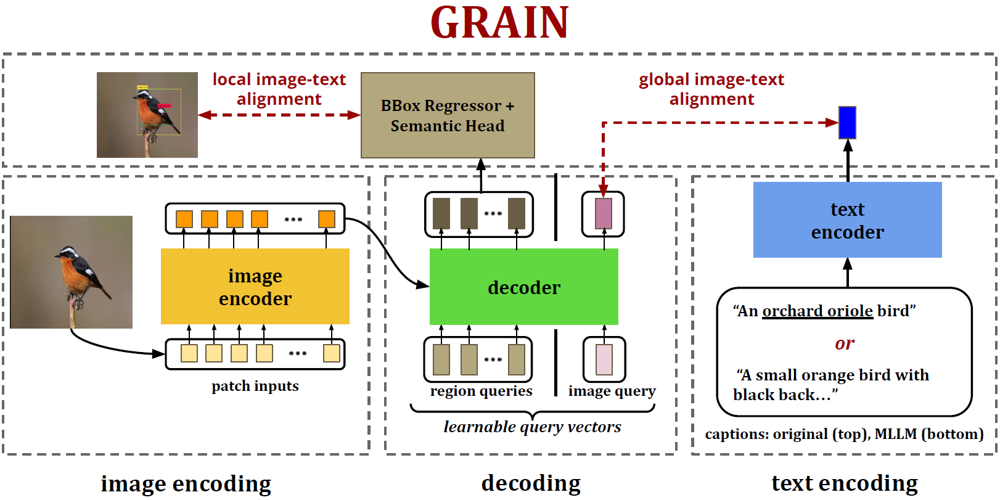

# Grounding Descriptions in Images informs Zero-Shot Visual Recognition

[Paper Link](https://shaunak27.github.io/data/GRAIN_full.pdf)

This repository contains code for our paper <b>GRAIN: Grounding Descriptions in Images informs Zero-Shot Visual Recognition</b>. GRAIN is a new pretraining strategy for CLIP to learn fine-grained visual representations.

<p align="center">
    
    <br />
  <a href="./LICENSE"></a>
  <a href="Python 3.8"></a>
  <a href="https://github.com/psf/black"></a>
</p>

Vision-language models (VLMs) like CLIP have been cherished for their ability to perform zero-shot visual recognition on open-vocabulary concepts. 
This is achieved by selecting the object category whose textual representation bears the highest similarity with the query image. 
While successful in some domains, this method struggles with identifying fine-grained entities as well as generalizing to unseen concepts that are not captured by the training distribution. 
Recent works attempt to mitigate these challenges by integrating category descriptions at test time, albeit yielding only modest improvements. 
We attribute these limited gains to a fundamental misalignment between image and description representations which is rooted in the pretraining structure of CLIP. 
In this paper, we propose <i>GRAIN</i>, a new pretraining strategy aimed at aligning representations at both fine and coarse levels simultaneously. 
Our approach learns to jointly ground textual descriptions in image regions along with aligning overarching captions with global image representations. 
To drive this pre-training, we leverage frozen Multimodal Large Language Models (MLLMs)
to derive synthetic annotations that are more fine-grained. We demonstrate the enhanced zero-shot performance of our model compared to current state-of-the art methods across 11 diverse image classification datasets. 
Additionally, our model is effective in recognizing new, unseen concepts and distinguishing between similar, fine-grained entities. 
Significant improvements achieved by our model on other downstream tasks such as retrieval further highlights the superior quality of representations learned by our approach. 

## Installation

1. Install the required dependencies by running the following command:

    ```shell
    conda env create -f vqloc_drop.yml
    ```
2. Download the Conceptual Captions dataset from [here](https://ai.google.com/research/ConceptualCaptions/download).

## Usage

To train the model, run the following command:

```shell
torchrun --nnodes=<n_nodes> --nproc_per_node=<n_gpus_per_node> \
--rdzv_id $RANDOM --rdzv_backend c10d --rdzv_endpoint $head_node_ip:<your_port> \
train.py --device_ids 0 1 2 3 4 5 6 7 --backbone CLIP_VITB16 --use_desc_train --batch_size 128 --lr 1e-3 --wd 0.1 --epochs 35 \
--warmup-epochs 1 --num_queries 5 --is_gala --data_dir /path/to/cc12m/ \
```
To evaluate the model, run the following command:

```shell 
torchrun --nnodes=<n_nodes> --nproc_per_node=<n_gpus_per_node> \
--rdzv_id $RANDOM --rdzv_backend c10d --rdzv_endpoint $head_node_ip:<your_port> \
evaluate.py --device_ids 0 1 2 3 4 5 6 7 --backbone CLIP_VITB16 --use_desc_train --batch_size 128 --lr 1e-3 --wd 0.1 --epochs 35 \
--warmup-epochs 1 --num_queries 5 --is_gala --resume <path_to_checkpoint> \
```
Experiments reported in the paper were conducted on 2*8 H100 GPUs with 80GB memory each.

## Annotations

We will make the synthetic annotations used in our paper available soon.

## License

This project is licensed under the [MIT License](LICENSE).

## Citing GRAIN
If you use GRAIN in your research, please cite [our paper](https://shaunak27.github.io/data/GRAIN_full.pdf).